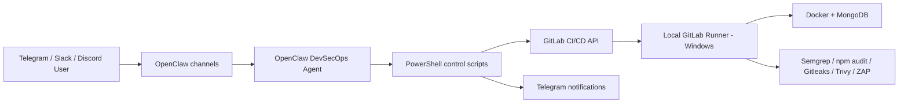

# Todo DevSecOps AI Agent

Agent DevSecOps pilote depuis Telegram, Slack et Discord avec OpenClaw. Le projet utilise une application Todo Node.js + MongoDB comme cible de demonstration, un runner GitLab local Windows, Docker, et des outils de securite automatises.

## Objectif

Controler un pipeline DevSecOps complet depuis un bot conversationnel:

- lancer, arreter, relancer et suivre un pipeline GitLab CI/CD;
- consulter les logs;
- executer les scans SAST, dependances, Docker, secrets et ZAP;
- deployer l'application Todo;
- recevoir les notifications critiques sur Telegram.

## Architecture



## Stack

- Backend: Node.js, Express, Mongoose
- Database: MongoDB
- CI/CD: GitLab CI with local Windows PowerShell runner
- Runtime: Docker and Docker Compose
- AI gateway: OpenClaw with OpenRouter
- Chat channels: Telegram, Slack, Discord
- Security: Semgrep, npm audit, Gitleaks, Trivy, OWASP ZAP

## Quick Start

```powershell
powershell -ExecutionPolicy Bypass -File scripts\install.ps1
docker compose up --build
```

Application:

```text
http://127.0.0.1:5000
http://127.0.0.1:5000/health
```

## Local Commands

```powershell
npm test
npm run check
powershell -ExecutionPolicy Bypass -File scripts\security-scan.ps1 -Mode dependencies
powershell -ExecutionPolicy Bypass -File scripts\security-scan.ps1 -Mode secrets
powershell -ExecutionPolicy Bypass -File scripts\security-scan.ps1 -Mode sast
powershell -ExecutionPolicy Bypass -File scripts\security-scan.ps1 -Mode docker
powershell -ExecutionPolicy Bypass -File scripts\zap-baseline.ps1 -TargetUrl http://127.0.0.1:5000
```

## OpenClaw Commands

The same command syntax is used on Telegram, Slack and Discord:

```text
/start
/help
/status [pipeline_id]
/run_pipeline [ref]
/stop_pipeline [pipeline_id]
/retry_pipeline [pipeline_id]
/scan [ref]
/deploy [staging|production] [ref]
/logs [pipeline_id] [job_name]
```

Install the shared OpenClaw prompts into the WSL Kali OpenClaw workspace:

```powershell
powershell -ExecutionPolicy Bypass -File scripts\openclaw-install-prompts.ps1
```

Optional binding check:

```powershell
wsl -d kali-linux -- openclaw agents bindings
```

## GitLab Variables

Configure these as local environment variables, CI/CD variables, or inside `.env` for local scripts:

```text
GITLAB_BASE_URL=https://gitlab.com
GITLAB_PROJECT_ID=<project id or url-encoded path>
GITLAB_REF=main
GITLAB_API_TOKEN=<token with api scope>
TELEGRAM_BOT_TOKEN=<telegram bot token>
TELEGRAM_CHAT_ID=<authorized chat id>
DAST_TARGET_URL=http://127.0.0.1:5000
ZAP_PATH=<optional full path to zap.bat>
SAST_SCANNERS=semgrep,sonarqube
SEMGREP_APP_TOKEN=<optional masked token>
SONAR_HOST_URL=http://host.docker.internal:9000
SONAR_TOKEN=<masked token>
SONAR_PROJECT_KEY=todo-devsecops
```

Do not commit real secrets. Use `.env.example` as the template.

## Local Runner

The pipeline is pinned to the local runner through this job tag:

```yaml
tags:
  - todo-app-runner
```

In GitLab, open **Settings > CI/CD > Runners**, select the runner named `todo-app-runner`, and make sure it has the tag `todo-app-runner`. Disable shared runners for the project if you want to guarantee that GitLab-hosted runners never pick up jobs.

The runner executable used locally is:

```text
C:\Gitlab-Runner\gitlab-runner.exe
```

The project remote is:

```text
https://gitlab.com/Simo-Zg/ToDo-app.git
```

## Pipeline

Pipeline stages:

1. `validate`: install dependencies and syntax check.
2. `test`: Jest tests.
3. `security`: dependency scan, secret scan, SAST, Docker image scan.
4. `package`: Docker image build and optional registry push.
5. `dast`: ZAP scan when `/scan` sets `RUN_ZAP=true`.
6. `deploy`: Docker Compose deployment when `/deploy` sets `RUN_DEPLOY=true`.
7. `notify`: Telegram status notification.

## Deliverables

- Todo Node.js + MongoDB app
- Dockerfile and docker-compose
- GitLab CI/CD pipeline
- PowerShell scripts for OpenClaw/GitLab/ZAP
- OpenClaw prompt catalog
- Technical documentation in `docs/`
- Final report source in `docs/FINAL_REPORT.md`
