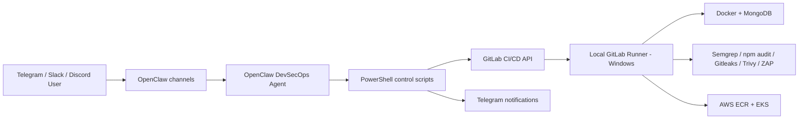

# Todo DevSecOps AI Agent

Agent DevSecOps pilote depuis Telegram, Slack et Discord avec OpenClaw. Le projet utilise une application Todo Node.js + MongoDB comme cible de demonstration, un runner GitLab local Windows, Docker, et des outils de securite automatises.

## Objectif

Controler un pipeline DevSecOps complet depuis un bot conversationnel:

- lancer, arreter, relancer et suivre un pipeline GitLab CI/CD;
- consulter les logs;
- executer les scans SAST, dependances, Docker, secrets et ZAP;
- deployer l'application Todo sur AWS EKS;
- recevoir les notifications critiques sur Telegram.

## Architecture



## Stack

- Backend: Node.js, Express, Mongoose
- Database: MongoDB
- CI/CD: GitLab CI with local Windows PowerShell runner
- Runtime: Docker and Docker Compose
- Cloud deployment: AWS ECR + AWS EKS + Kubernetes
- Infrastructure as Code: Terraform for AWS staging
- AI gateway: OpenClaw with OpenRouter
- Chat channels: Telegram, Slack, Discord
- Security: Semgrep, npm audit, Gitleaks, Trivy, OWASP ZAP

## Quick Start

```powershell
powershell -ExecutionPolicy Bypass -File scripts\install.ps1
docker compose up --build
```

Application:

```text
http://127.0.0.1:5000
http://127.0.0.1:5000/health
```

## Local Commands

```powershell
npm test
npm run check
powershell -ExecutionPolicy Bypass -File scripts\security-scan.ps1 -Mode dependencies
powershell -ExecutionPolicy Bypass -File scripts\security-scan.ps1 -Mode secrets
powershell -ExecutionPolicy Bypass -File scripts\security-scan.ps1 -Mode sast
powershell -ExecutionPolicy Bypass -File scripts\security-scan.ps1 -Mode docker
powershell -ExecutionPolicy Bypass -File scripts\zap-baseline.ps1 -TargetUrl http://127.0.0.1:5000
```

## OpenClaw Commands

The same command syntax is used on Telegram, Slack and Discord:

```text
/start
/help
/status [pipeline_id]
/run_pipeline [ref]
/stop_pipeline [pipeline_id]
/retry_pipeline [pipeline_id]
/scan [ref]
/deploy [staging|production] [ref]
/logs [pipeline_id] [job_name]
```

Install the shared OpenClaw prompts into the WSL Kali OpenClaw workspace:

```powershell
powershell -ExecutionPolicy Bypass -File scripts\openclaw-install-prompts.ps1
```

Optional binding check:

```powershell
wsl -d kali-linux -- openclaw agents bindings
```

## GitLab Variables

Configure these as local environment variables, CI/CD variables, or inside `.env` for local scripts:

```text
GITLAB_BASE_URL=https://gitlab.com
GITLAB_PROJECT_ID=<project id or url-encoded path>
GITLAB_REF=main
GITLAB_API_TOKEN=<token with api scope>
TELEGRAM_BOT_TOKEN=<telegram bot token>
TELEGRAM_CHAT_ID=<authorized chat id>
DAST_TARGET_URL=http://127.0.0.1:5000
ZAP_PATH=<optional full path to zap.bat>
SAST_SCANNERS=semgrep
SEMGREP_APP_TOKEN=<optional masked token>
SONAR_HOST_URL=http://host.docker.internal:9000
SONAR_TOKEN=<masked token>
SONAR_PROJECT_KEY=todo-devsecops
AWS_REGION=eu-west-3
AWS_ACCOUNT_ID=<optional, auto-detected by AWS STS if omitted>
AWS_ACCESS_KEY_ID=<masked GitLab variable>
AWS_SECRET_ACCESS_KEY=<masked GitLab variable>
AWS_SESSION_TOKEN=<optional, only for temporary credentials>
AWS_ECR_REPOSITORY=todo-app
AWS_EKS_CLUSTER_NAME=todo-devsecops-eks
K8S_SERVICE_TYPE=LoadBalancer
K8S_STAGING_NAMESPACE=todo-staging
K8S_PRODUCTION_NAMESPACE=todo-production
```

Do not commit real secrets. Use `.env.example` as the local name template only.
For GitLab pipelines, store sensitive values as masked CI/CD variables or expose them through HashiCorp Vault with the same environment variable names:

Required sensitive CI/CD variables:

- `GITLAB_API_TOKEN`: GitLab token used by OpenClaw commands to create, retry, cancel, inspect and play pipelines.
- `TELEGRAM_BOT_TOKEN`: Telegram notification bot token.
- `TELEGRAM_CHAT_ID`: authorized Telegram chat id for notifications.
- `JWT_SECRET`: application access-token secret for Kubernetes deployment.
- `JWT_REFRESH_SECRET`: application refresh-token secret for Kubernetes deployment.
- `SECRET_PASSWORD`: application secret password for Kubernetes deployment.
- `AES_KEY`: application encryption key for Kubernetes deployment.

Required AWS deployment CI/CD variables:

- `AWS_ACCESS_KEY_ID`
- `AWS_SECRET_ACCESS_KEY`
- `AWS_REGION`
- `AWS_ECR_REPOSITORY`
- `AWS_EKS_CLUSTER_NAME`
- `K8S_STAGING_NAMESPACE`
- `K8S_PRODUCTION_NAMESPACE`
- `K8S_SERVICE_TYPE`

Optional CI/CD variables:

- `AWS_SESSION_TOKEN`: only for temporary AWS credentials.
- `AWS_ACCOUNT_ID`: optional because the ECR script can read it through AWS STS.
- `SEMGREP_APP_TOKEN`: optional unless Semgrep Cloud is required.
- `SONAR_TOKEN`: required only when SonarQube is explicitly re-enabled.
- `SONAR_HOST_URL`: defaults to `http://host.docker.internal:9000`.
- `SONAR_PROJECT_KEY`: defaults to `todo-devsecops`.
- `DAST_TARGET_URL`: defaults to `http://127.0.0.1:5000`.
- `ZAP_PATH`: only needed if ZAP is installed outside the common Windows paths.
- `ZAP_TIMEOUT_SECONDS`: defaults to `180` in CI.

For a stricter real-production simulation, do not mark jobs with `allow_failure`. This pipeline is configured to fail on scanner errors, blocking vulnerabilities, missing configured credentials, AWS packaging errors, AWS deployment errors, and Telegram notification errors.

Azure is intentionally not used in this project. The previous Azure Terraform path was removed to avoid accidental billing.

## AWS Kubernetes Deployment

The AWS path uses EKS with exactly two application pods:

- `todo-app`: 1 pod
- `mongodb`: 1 pod

Provision AWS staging infrastructure:

```powershell
cd terraform\aws-staging
copy terraform.tfvars.example terraform.tfvars
terraform init
terraform plan
terraform apply
```

Deploy from GitLab/OpenClaw:

```text
/deploy staging AI-Agent
```

On the `AI-Agent` branch, AWS staging deployment is part of the normal pipeline. The staging job uses a Kubernetes `LoadBalancer`, writes `APP_URL` to `reports/aws/deployment.env`, and GitLab uses it as the environment URL.

The deploy command creates a deploy pipeline with AWS variables enabled. AWS jobs are required in that pipeline, so an AWS package or deployment failure fails the pipeline:

1. `aws_ecr_package`: build and push the Todo image to AWS ECR.
2. `deploy_aws_staging`: deploy `todo-app` and `mongodb` to EKS.

Production is available through `/deploy production <ref>`, but it requires production secrets and should only be used deliberately.

## Local Runner

The pipeline is pinned to the local runner through this job tag:

```yaml
tags:
  - todo-app-runner
```

In GitLab, open **Settings > CI/CD > Runners**, select the runner named `todo-app-runner`, and make sure it has the tag `todo-app-runner`. Disable shared runners for the project if you want to guarantee that GitLab-hosted runners never pick up jobs.

The runner executable used locally is:

```text
C:\Gitlab-Runner\gitlab-runner.exe
```

The project remote is:

```text
https://gitlab.com/Simo-Zg/ToDo-app.git
```

## Pipeline

Pipeline stages:

1. `validate`: syntax check without dependency installation.
2. `test`: Jest tests.
3. `security`: dependency scan, secret scan, SAST, Docker image scan.
4. `package`: Docker image build and optional registry push.
5. `zap`: OWASP ZAP scan.
6. `deploy`: AWS EKS deployment when `/deploy staging` or `/deploy production` enables AWS jobs.
7. `notify`: Telegram status notification.

## Deliverables

- Todo Node.js + MongoDB app
- Dockerfile and docker-compose
- GitLab CI/CD pipeline
- PowerShell scripts for OpenClaw/GitLab/ZAP
- OpenClaw prompt catalog
- Technical documentation in `docs/`
- Final report source in `docs/FINAL_REPORT.md`
