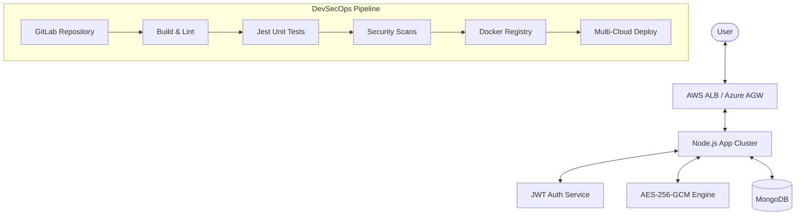

# 🚀 DevSecOps Todo: Enterprise-Grade Task Management

[](https://gitlab.com)
[](https://www.docker.com/)
[](https://kubernetes.io/)
[](https://www.terraform.io/)
[](https://github.com/zricethezav/gitleaks)

A modern, highly secure Todo application built with Node.js and MongoDB, featuring a full DevSecOps pipeline, multi-cloud automated deployments (AWS & Azure), and high-availability container orchestration.

---

## 🏗️ Architecture & System Design

The application follows a modular, layer-based architecture designed for scalability and security.



### Key Components
- **Core Engine**: Node.js/Express with a modular controller-service-model pattern.
- **Security Engine**: Transparent AES-256-GCM encryption for task data and Bcrypt for passwords.
- **Identity Provider**: JWT-based authentication with secure cookie handling.
- **Data Persistence**: MongoDB with Mongoose ODM.
- **Observability**: Real-time IP-based logging and geo-location tracking.

---

## 🛠️ Technology Stack

| Category | Technologies |
| :--- | :--- |
| **Backend** | Node.js, Express, Mongoose |
| **Database** | MongoDB Atlas / Self-hosted |
| **Security** | JWT, Bcrypt, AES-256-GCM, Gitleaks, NPM Audit |
| **Testing** | Jest, Supertest |
| **DevOps** | GitLab CI/CD, Docker, Kubernetes (K8s) |
| **IaC** | Terraform (HCL) |
| **Cloud** | AWS (Fargate/ECS), Azure (App Service) |

---

## 🛡️ DevSecOps Pipeline (GitLab CI/CD)

The project implements a comprehensive **Shift-Left** security approach, integrating automated scans directly into the CI/CD lifecycle.

### Pipeline Stages
1.  **Build**: Dependency installation and syntax verification using `node -c`.
2.  **Test**: Execution of the Jest testing suite with coverage reporting.
3.  **Security**:
    -   **Secret Detection**: [Gitleaks](https://github.com/zricethezav/gitleaks) scans every commit for exposed API keys or credentials.
    -   **SCA (Software Composition Analysis)**: `npm audit` identifies and blocks builds with high-risk dependency vulnerabilities.
4.  **Package**: Automated Docker image building and versioning, pushed to the GitLab Container Registry.
5.  **Deploy**: 
    -   **Staging**: Automated deployment to AWS Fargate via Terraform.
    -   **Production**: Gate-protected manual deployment to Azure Web App for Containers.

---

## ☸️ Container Orchestration & K8s Simulation

For high availability and seamless scaling, the application is ready for Kubernetes.

### Local K8s Simulation
The project includes a "Hands-on Simulation" guide to test the production-grade architecture locally using **Docker Desktop + WSL2 (Kali Linux)**.

- **Scaling**: Deploys **3 scalable application pods** for load-balanced traffic.
- **Self-Healing**: Kubernetes automatically restarts pods if they fail.
- **Service Discovery**: Internal load balancer (Service) distributes traffic to specialized pods.

> [!TIP]
> See the [Kubernetes Deployment Guide](file:///d:/Projects/todo-app/k8s_deployment_guide.md) for step-by-step instructions on running the cluster.

---

## 🌍 Multi-Cloud Infrastructure (IaC)

We use **Terraform** to manage infrastructure as code, ensuring environment parity between Staging and Production.

### ☁️ AWS (Staging Environment)
-   **Service**: Amazon ECS with Fargate (Serverless).
-   **Network**: Private VPC with Application Load Balancer (ALB).
-   **Configuration**: [terraform/aws-staging/](file:///d:/Projects/todo-app/terraform/aws-staging/)

### ☁️ Azure (Production Environment)
-   **Service**: Azure Web App for Containers.
-   **Deployment**: Continuous Deployment from GitLab Registry.
-   **Configuration**: [terraform/azure-production/](file:///d:/Projects/todo-app/terraform/azure-production/)

---

## 🚀 Getting Started

### 1. Local Development
```bash
# Install dependencies
npm install

# Setup environment variables
cp env-example.txt .env # Configure your MongoDB URI and Secrets

# Run in development mode
npm run dev
```

### 2. Run Tests
```bash
npm run test
```

### 3. Build Docker Image
```bash
docker build -t todo-app:latest .
```

---

## 👤 Author
**Mohammed ZGUIOUI**
- GitHub: [Simo-Zg](https://github.com/Simo-Zg)

---