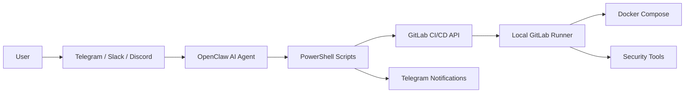

# Final Report - Telegram Controlled DevSecOps AI Agent

## 1. Introduction

The goal of this semester project is to build an AI agent able to operate a complete DevSecOps workflow from Telegram. The selected implementation uses OpenClaw because it already connects AI agents to Telegram, Slack and Discord, and can execute local scripts on behalf of the operator.

The controlled application is a Todo web app built with Node.js, Express and MongoDB. This simple business domain keeps the demonstration understandable while still supporting realistic DevSecOps controls.

## 2. Problem Statement

Development teams need fast access to CI/CD and security information without opening many dashboards. The project solves this by exposing operational commands through chat:

- pipeline control;
- security scan execution;
- log consultation;
- deployment;
- alerting.

## 3. Architecture

## 4. Implementation

The repository contains:

- Node.js Todo application;
- MongoDB data layer;
- Dockerfile and `docker-compose.yml`;
- GitLab CI/CD pipeline;
- OpenClaw prompt catalog;
- PowerShell automation scripts;
- security reports generated under `reports/`.

## 5. Chat Commands

| Command | Result |
| --- | --- |
| `/start` | bot introduction |
| `/help` | command list |
| `/status` | latest GitLab pipeline status |
| `/run_pipeline` | starts a GitLab pipeline |
| `/stop_pipeline` | cancels a pipeline |
| `/retry_pipeline` | retries failed/canceled jobs |
| `/scan` | starts the security workflow |
| `/deploy` | starts deployment |
| `/logs` | returns recent job logs |

## 6. DevSecOps Controls

| Security Area | Tool |
| --- | --- |
| SAST | Semgrep |
| SAST / code quality | SonarQube |
| Dependencies | npm audit |
| Docker image | Trivy |
| Secrets | Gitleaks |
| DAST | OWASP ZAP |
| Monitoring | `/health`, Docker healthcheck, Telegram notifications |

## 7. CI/CD Pipeline

The pipeline is designed for the local GitLab Runner installed in `C:\Gitlab-Runner` with a PowerShell shell executor.

Stages:

1. validate;
2. test;
3. security;
4. package;
5. dast;
6. deploy;
7. notify.

## 8. Deployment

The demonstration deployment uses Docker Compose. It starts:

- `todo-app`;
- `todo-mongodb`;
- persistent MongoDB volume.

The deployment script waits for `/health` before reporting success.

## 9. Security Considerations

Secrets are never stored in prompts. The OpenClaw instructions explicitly forbid printing `.env` contents and API tokens. GitLab and Telegram credentials are passed through environment variables.

Potential production improvements:

- store secrets in GitLab protected variables;
- use HTTPS and secure cookies;
- restrict Telegram/Slack/Discord users with allowlists;
- sign deployment approvals;
- forward logs to a SIEM.

## 10. Conclusion

The project demonstrates a complete chat-operated DevSecOps workflow. OpenClaw acts as the AI command layer, GitLab CI/CD executes the pipeline, Docker runs the application, and security tools provide automated checks. The same command catalog works across Telegram, Slack and Discord, satisfying the requirement for a Telegram-first AI DevSecOps agent while keeping the implementation extensible.
