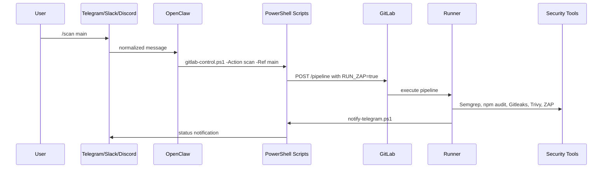

# Technical Documentation

## Project Summary

This project demonstrates a DevSecOps AI agent controlled from Telegram, Slack and Discord through OpenClaw. The controlled target is a Todo web application built with Node.js, Express and MongoDB.

The agent does not embed secrets in prompts. It delegates sensitive operations to local PowerShell scripts and uses environment variables for GitLab, Telegram and ZAP configuration.

## Components

| Component | Role |
| --- | --- |
| OpenClaw | Chat gateway and AI agent runtime |
| Telegram / Slack / Discord | User control channels |
| PowerShell scripts | Deterministic execution layer |
| GitLab API | Pipeline control |
| GitLab Runner | Local Windows execution |
| Docker Compose | App and MongoDB runtime |
| Semgrep | SAST |
| npm audit | Dependency scan |
| Gitleaks | Secret detection |
| Trivy | Docker image scan |
| OWASP ZAP | DAST scan |

## Runtime Flow



## Application

The application exposes:

- `/`: landing page
- `/notes`: Todo UI after authentication
- `/signin` and `/signup`: authentication pages
- `/dashboard`: admin dashboard
- `/api/tasks`: task API
- `/api/logs`: admin logs API
- `/health`: monitoring endpoint used by Docker and CI

MongoDB connection uses `MONGO_DB_URI` when provided, otherwise it builds a URI from `MONGO_HOST`, `MONGO_PORT` and `MONGO_DB`.

## OpenClaw Prompt Strategy

Prompts are stored in `openclaw/` and installed into `~/.openclaw/workspace/devsecops-prompts`.

The shared router in `AGENTS.md` instructs OpenClaw to read the same command catalog regardless of channel. This keeps Telegram, Slack and Discord aligned.

Main prompt files:

- `openclaw/DEVSECOPS_AGENT.md`
- `openclaw/COMMANDS.md`
- `openclaw/commands/*.md`

## GitLab API Control

`scripts/gitlab-control.ps1` supports:

- `run`
- `status`
- `stop`
- `retry`
- `logs`
- `scan`
- `deploy`

Required variables:

- `GITLAB_BASE_URL`
- `GITLAB_PROJECT_ID`
- `GITLAB_API_TOKEN`
- `GITLAB_REF`

## Security Pipeline

| Scan | Job | Report |
| --- | --- | --- |
| SAST | `sast_scan` | `reports/semgrep/semgrep.json` |
| Dependencies | `dependency_scan` | `reports/npm-audit/npm-audit.json` |
| Secrets | `secret_scan` | `reports/gitleaks/gitleaks.json` |
| Docker image | `docker_image_scan` | `reports/trivy/trivy-image.json` |
| DAST | `zap_dast_scan` | `reports/zap/zap-*.html` |

## Deployment

The demo deployment uses Docker Compose:

```powershell
powershell -ExecutionPolicy Bypass -File scripts\deploy-local.ps1 -Environment staging
```

The deploy command creates or updates:

- `todo-app`
- `todo-mongodb`

Then it waits for `/health` before sending a Telegram notification.
